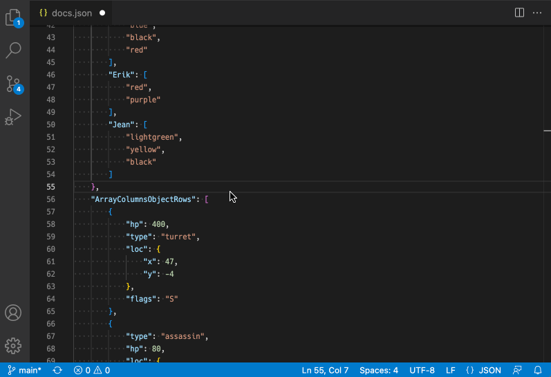
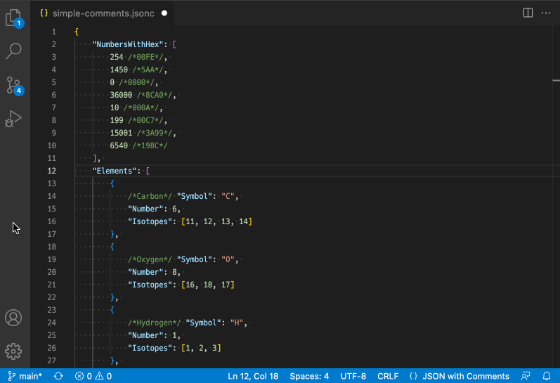

# FracturedJson for Visual Studio Code

A JSON and JSONC formatter that produces human-readable but fairly compact output.

* Arrays and objects are written on single lines, if their contents aren't too complex and the resulting line wouldn't be too long.
* Longer arrays will be written on multiple lines, with multiple items per line, as long as those items aren't too complex.
* If several successive inline arrays or objects are similar enough, they will be formatted as a table, with their properties aligned.
* Otherwise, each object property or array item is written beginning on its own line, indented one step deeper than its parent.

There are lots of settings available to control the output, but for the most part you can ignore them. FracturedJson produces nice-looking output from any set of JSON data automatically.  If comments are present, FracturedJson is smart about keeping them with the elements to which the refer when things are moved around.

This VSCode extension is part of a family of FracturedJson tools.  Check out the [browser-based formatter](https://j-brooke.github.io/FracturedJson/) to see related projects and to try out the various formatting options.

---

## Features

### Formatting a whole document

FracturedJson registers with VSCode's formatting API, so the easiest way to format a whole document is to right-click on the document and choose "Format Document" or "Format Document With...".  This only works if VSCode recognizes the document's language to be "JSON" or "JSON with Comments".

If you prefer, you can choose "Format JSON Document" from the Command Palette.  This works even if VSCode doesn't realize that the document is JSON.

### Formatting a selection

You can choose "Format Selection" or "Format Selection With..." from the context menu to format just a portion of the document.  The selection can be a single JSON element, or a collection of them belonging to the same object or array.  You can also use "Format JSON Selection" from the Command Palette.

### Minify a document

Choose "Minify JSON Document" from the Command Palette to remove all unnecessary space from the document.  If the setting `Preserve Blank Lines` is checked, or if the comment policy setting is set to `Preserve`, newlines will be used to keep those intact.

### Near-minify a document

The "Near-minify JSON Document" command from the Command Palette reformats the document so that each child of the root element is written on its own line, but otherwise minified.  For documents where the root element is a large array of complex items, this can sometimes make it easy to cherry-pick specific items.

---

## Extension Settings

You can tune the formatting behavior with the properties in Settings -> Extensions -> FracturedJson.  The most important settings are:

* `Max Total Line Length`: Maximum length of a complete line (including indentation) when trying to inline object/arrays or fit multiple items in a compact multiline array.
* `Max Inline Complexity`: Maximum nesting level for objects/arrays written on single lines.
* `Max Compact Array Complexity`: Maximum nesting level that can be arranged spanning multiple lines, with multiple items per line.
* `Max Table Row Complexity`: Maximum nesting level for objects/arrays written as rows of a table.  (That is, with their children written lined up with the rows above and below them.)

Indentation is controlled by the editor's standard settings (`editor.insertSpaces`, `editor.tabSize`, `editor.detectIndentation`, etc.).

Examples of all of the settings can be found on the [Options wiki page](https://github.com/j-brooke/FracturedJson/wiki/Options).  You can also experiment with the same functionality on the [browser-based formatter](https://j-brooke.github.io/FracturedJson/) page.

---

## Limitations and Troubleshooting

### Format Selection Doesn't Always Work

FracturedJson's **Format Selection** can only process selections that are either complete JSON elements by themselves (possibly with comments before or after), or groups of complete JSON elements that would be valid if surrounded by array or object brackets.  If won't work if your selection contains imbalanced opening and closing brackets, for instance.

---

## Release Notes

### 4.0.0

Replaced setting `Don't Justify Numbers` with a new one, `Number List Alignment`, to control how arrays or table columns of numbers are handled.  Use `Normalize` if you want columns of numbers to be re-written with the same number of digits after the decimal point.  Use `Left` or `Right` if you want the numbers preserved exactly as they are in the original document, but lined up to one side or the other.  Use `Decimal` if you want the numbers preserved but lined up according to their decimal points.

### 3.1.2

* Fixed a [bug](https://github.com/j-brooke/FracturedJson/issues/27) where numbers that overflow or underflow a 64-bit float could (depending on settings) be written to the output as `Infinity` or `0`.  In the overflow case, that caused output to be invalid JSON.  With this fix, FracturedJson recognizes that it can't safely reformat numbers like this, and uses the exact number representation from the original document.

### 3.1.1

**Settings Change**

The setting `String Width Policy` has a new default behavior.  The default value of `East Asian Full Width` now treats glyphs identified in [Unicode Standard Annex #11](https://www.unicode.org/reports/tr11/) as "ambiguous" as narrow instead of wide, as recommended by the annex.  Some of those ambiguous glyphs are commonly used some western languages, and so the old behavior of treating them as wide was messing those up.

In case anyone was relying on the old behavior, I've introduced a new option - `East Asian Treat Ambiguous As Wide` - to try to preserve that behavior.

The third option is just like before: `Character Count` treats each UTF-16 character as having the same width.

### 3.1.0

New setting: `Omit Trailing Whitespace`.  Defaults to `true`.  When checked, there will never be spaces or tabs at the end of lines of formatted code.

### 3.0.0

**New features:**
* Comments are now supported.  There are two different settings for how to handle comments: one for "JSON" and one for "JSON with Comments".  For each, your choices are `Treat as Error`, `Remove`, and `Preserve`.
* Deep table formatting. In version 2, only the immediate children of table rows were lined up. Now, if space permits and the types are consistent, all descendants are aligned as table columns.
* New length limit option: `MaxTotalLineLength`.  `MaxTotalLineLength` restricts total line size, while the older setting, `MaxInlineLength`, doesn't count indentation.  You can use both if you want, but most people will probably just want `MaxTotalLineLength`.  Note that the length restrictions only apply to combined elements like arrays and objects.  A single element with its property name and attached comments may still exceed these limits.
* Option to preserve blank lines.
* Option to ignore trailing commas.
* Numbers with many significant digits are faithfully preserved.  In version 2, all numbers were parsed into 64-bit floats before processing, so numbers with more than 16 significant digits would lose precision.  Now, such numbers are kept exactly how they were.

**Settings reset:**  Many of the settings have changed.  Old settings from version 2 will be wiped out.

### 2.2.2

Updated `npm` packages to address security concern.

### 2.2.1

* New setting `String Width Policy` determines how many spaces are used as padding to line up columns when formatted as a table.
    * Option `EastAsianFullWidth` (default) uses two spaces for East Asian "fullwidth" symbols, and one space for others.
    * Option `CharacterCount` treats each character as having the width of one space.
* New setting `Simple Bracket Padding` controls whether brackets should have spaces inside when they contain only simple elements.  (The old setting `Nested Bracket Padding` is used when they contain other arrays/objects.)

### 2.1.0

* Hooked into VSCode's formatter API, allowing FracturedJson to be used as a default formatter.  That allows for such features as format-on-save, format-on-paste, etc.
* Updated to FracturedJsonJS 2.0.1 behind the scenes to fix a bug where escaped characters in property names weren't being preserved, resulting in invalid JSON.

### 2.0.0

FracturedJson now tries to format collections of inline arrays/objects in a tabular arrangement if it seems to make sense.  Two new settings - `Table Object Minimum Similarity` and `Table Array Minimum Similarity` - control how similar the inlined elements need to be to their siblings to qualify.  (Other settings, like `Max Inline Length` also factor in.)

In tables, and in arrays of just numbers, numbers are usually written right-aligned and with the same precision.  You can disable this behavior with the setting `Don't Justify Numbers`.

### 1.0.0

Initial release